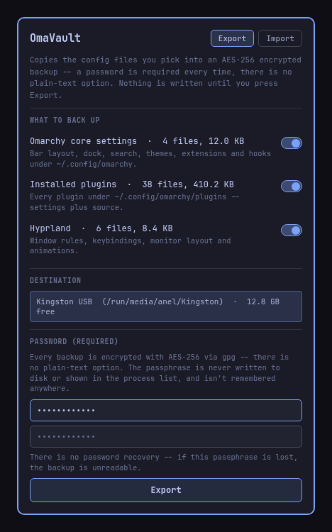
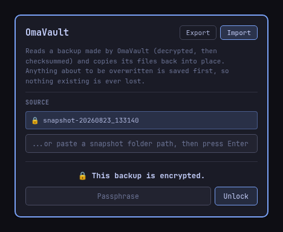

# OmaVault

Back up your Omarchy setup -- bar/dock/search/theme settings, installed
plugins, Hyprland config, terminal configs, and (opt-in) shell/editor
dotfiles -- to a folder tree, typically a USB stick, and restore it on a
fresh Omarchy install. Click the teal **OV** chip on the bar.

<p align="center">
  
  
</p>

*(Mockups reproduced from the actual popup's QML/copy to illustrate the
layout -- not raw screen captures. Real file counts/sizes/drive names will
differ on your machine.)*

## Install

```
omarchy plugin add https://github.com/anelcelik/omavault --enable
```

Or clone it yourself into `~/.config/omarchy/plugins/io.github.anelcelik.omavault/`
and run `omarchy plugin enable io.github.anelcelik.omavault`.

## Design

- **Always encrypted -- no plain-text option.** Every export builds a
  mirrored copy of your real config files (`config/omarchy/...`,
  `config/hypr/...`, `dotfiles/.bashrc`, ...) in a scratch dir, then packs
  the whole thing -- including `manifest.json` and `README.txt`, nothing
  carved out -- into one `payload.tar.gpg` (AES-256 via `gpg --symmetric`)
  and deletes the plaintext scratch copy. Nothing about a backup is
  readable off the stick without the passphrase: not the file contents,
  not the category labels, not even the source hostname. Non-text files
  (icons, sqlite dbs, compiled caches) are left out automatically before
  packing and listed in the backup's own (encrypted) `README.txt`. The
  passphrase travels over each process's stdin, never argv or disk, and
  isn't remembered anywhere -- there's no recovery if it's lost.
- **Checksummed, not just copied.** Every export writes a `SHA256SUMS`
  covering every file (manifest.json included) before encrypting. Import
  decrypts, verifies the whole thing before touching anything on this
  machine, and refuses to restore if a checksum fails.
- **Non-destructive restore.** Anything an import is about to overwrite is
  copied first to `~/.local/state/omavault/pre-restore-<timestamp>/`.
  Restoring only adds/overwrites -- it never deletes existing files.
- **Decryption happens in memory, not on disk.** Import decrypts into a
  tmpfs temp dir (`$XDG_RUNTIME_DIR`, never the disk or the stick), wiped
  again once the popup closes or the restore attempt finishes.
- **You choose what's included, every time.** The Export tab lists every
  category it found on this machine with a live file count/size and a
  plain-language description; nothing is exported until you press Export.
- **In-popup folder browser**, not a native file-picker dialog -- a native
  GTK/portal `FolderDialog` reliably crashed the whole Quickshell process
  in testing (GVFS aborting inside libgtk-3's directory-monitor D-Bus
  call). "Browse..." instead lists real subdirectories via a small bash
  script + QML list, entirely in-process.

## Layout

```
bin/lib.sh                Category registry (source→snapshot path map) + shared helpers
bin/list-categories.sh    What's exportable on this machine, with live file counts
bin/list-drives.sh        Detected removable drives + any OmaVault snapshots already on them
bin/list-dir.sh           Powers the in-popup folder browser
bin/export.sh             Builds a snapshot and encrypts it (stdin passphrase, required)
bin/inspect-snapshot.sh   Reads manifest.json + verifies SHA256SUMS, without touching the machine
bin/decrypt-snapshot.sh   Decrypts payload.tar.gpg into a tmpfs temp dir (stdin passphrase)
bin/cleanup-temp.sh       Removes a decrypt-snapshot.sh temp dir
bin/import.sh             Backs up existing files, then restores selected categories
```

Adding a new category means one entry in `lib.sh`'s `list_category_meta`
(the checkbox + description) and `category_entries` (the real path ->
snapshot path mapping) -- every script shares that one registry.
